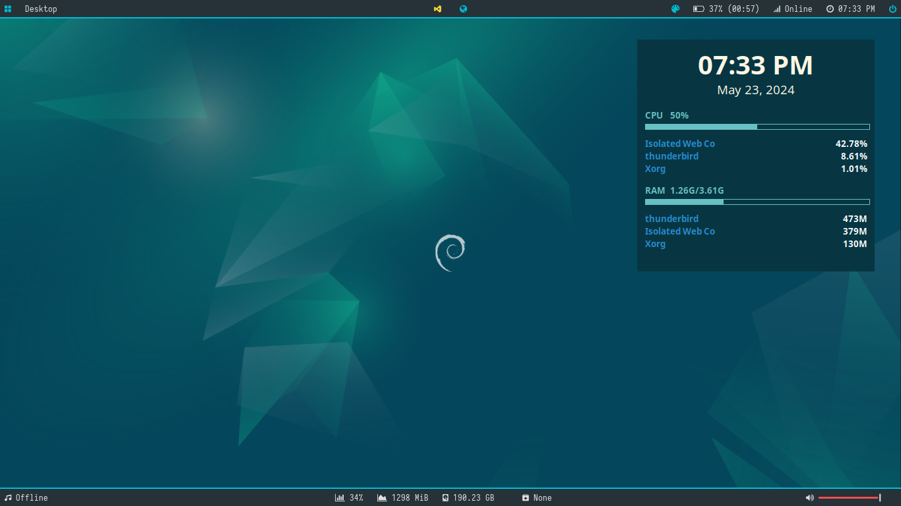

# Door Lightweight Desktop Environment (Debian Edition)



**This is a lightweight desktop environment that I use to my daily computing activities.**

You  may download this repository via GitHub to install the desktop environment. Just unzip the file and run to the terminal the following command:

```cd dlde/```

to move to the DLDE directory, and:

```sh install.sh```

Afterwards, answer the questions during installation. This may take a while. Be patient.

To install entirely from command line, type the following:

```git clone https://github.com/10542hsrif/dlde```

to clone from the `git` repo, then:

```cd dlde/```

to change directory of the installer, then:

```sh install.sh```

to start the installer. Answer the questions during installation. This may take a while. Be patient.
The system will then reboot. After you logged in at you freshly installed DLDE, you may now delete the installer directory by typing:

```sudo rm -rf dlde/```

Remember to include the ```sudo``` command as the directory won't permit you to delete itself without sudo privileges.

>Note: This repo isn't updated as frequent as other acively developed desktop environments. The developer focuses more on the stability of the software and adheres to the UNIX philosophy so updates or new features won't come unless needed or requested. If you (the user) wants to add new features to the software, the developer is encouraging you to put it in the "Issues" tab. Anyone may contribute to the code freely as they wish. Just make sure that you apply a pull request whenever you make modifications to the software.

**Recommendations**

1. It is recommended for new users to go to lightdm-settings (Login Window), and tweak the autologin part of it.
2. lxappearance (Customize Look and Feel) may be opened to configure the appearance settings.
3. `./.config/polybar/launch.sh` may be run to change the bar.
4. More ricing options at the `.config/i3/config` file.
5. Either `nitrogen` or `feh` may be used as a wallpaper setter.
6. The repo folder is advised to be at the `$HOME` directory in order to avoid any conflicts or problems.
